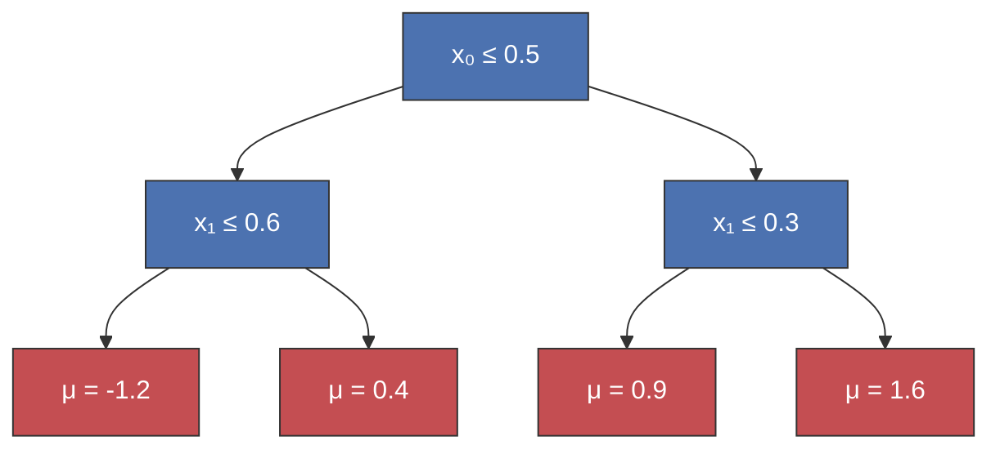
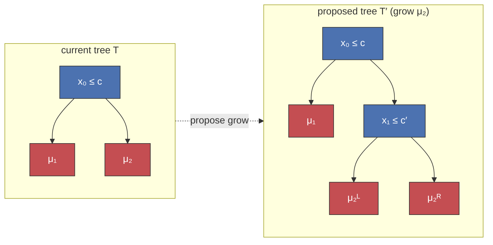

# How BART works

<div class="text-3xl text-sky-700 opacity-90 mt-1 mb-12">Bayesian Additive Regression Trees, from scratch</div>

**Chris Fonnesbeck** · PyData London 2026

<!--
- Session 1 of the BART tutorial: the algorithm itself.
- By the end we will have walked every moving part of the sampler — no library, pure NumPy.
- Notebooks then drive pymc-bart on real problems.
-->

---
layout: section
color: navy
---

# Start with a familiar model

<!-- Before adding anything, look at what plain gradient boosting gives us. -->

---

# Gradient boosting


<!--
- sklearn GradientBoostingRegressor, defaults. 80 noisy points, a step at x=0.4 and a hump at x=0.75.
- Fast, accurate point predictor.
- But: one curve, no uncertainty, equally committed where data is dense and where it is sparse.
-->

---

# Same data, with BART


<!--
- Same sum-of-trees structure, plus a full posterior: blue posterior mean + shaded 90% band.
- The band widens where the data thins out — calibrated uncertainty.
- We will build every line of this fit in pure NumPy.
-->

---

# So what is BART?

<div class="bart-essence">
  <div class="bart-row">
    <div class="bart-label">Structure</div>
    <div class="bart-text"><span class="bart-lead">Like gradient boosting</span> — a prediction is a sum of many small trees.</div>
  </div>
  <div class="bart-row">
    <div class="bart-label">Fitting</div>
    <div class="bart-text"><span class="bart-lead">Not stagewise boosting</span> — posterior backfitting, not greedy residual chasing.</div>
  </div>
  <div class="bart-row">
    <div class="bart-label">Output</div>
    <div class="bart-text"><span class="bart-lead">Bayesian</span> — posterior draws over functions give credible bands.</div>
  </div>
</div>

<!--
- Weak learner is not the distinction; boosting uses weak learners too.
- Structure: same additive sum-of-trees idea.
- Fitting: backfit through the posterior, not greedy residual chasing.
- Output: function draws give the credible bands.
-->

---
layout: section
color: navy
---

# Bayesian inference, briefly

<!-- One linear primer; lead with intuition. -->

---
layout: side-title
side: left
color: sky-light
titlewidth: is-5
align: rm-lm
---

::title::

# Bayes' rule

::content::

$$\Large \underbrace{P(\theta \mid D)}_{\textcolor{#c44e52}{\text{posterior}}} = \frac{\overbrace{P(D \mid \theta)}^{\textcolor{#c44e52}{\text{likelihood}}} \cdot \overbrace{P(\theta)}^{\textcolor{#c44e52}{\text{prior}}}}{\underbrace{P(D)}_{\textcolor{#c44e52}{\text{evidence}}}}$$

<!--
- A parameter is a distribution, not a single value: prior belief, updated by the likelihood, yields the posterior.
- The evidence is the marginal likelihood — it returns shortly.
- With more data the likelihood dominates; with less, the prior. In BART, the prior is exactly what keeps each tree a weak learner.
-->


---
layout: two-cols-title
color: sky-light
---

::title::

# The Gaussian model

::left::

## Priors

Mean:

$$\Large \mu \sim \mathcal{N}(\mu_0, \tau^2)$$

Noise:

$$\Large \sigma^2 \sim \text{Inv-}\chi^2(\nu, \lambda)$$

::right::

## Likelihood

Given the mean and noise variance:

$$\Large y_i \mid \mu, \sigma^2 \sim \mathcal{N}(\mu, \sigma^2)$$

<br>

Bayes combines these into conditional updates for $\mu$ and $\sigma^2$.

<!--
- The model has two priors: one for the mean and one for the noise variance.
- This mirrors BART later: leaf values have a Normal prior and sigma has an inverse-chi-square prior.
- The likelihood says how readings would look given both unknowns.
-->
---
layout: center
---

# Conditional update for the mean

Given the current $\sigma^2$, Normal prior + Normal likelihood gives:

$$\Large \mu \mid y \sim \mathcal{N}\!\left( \underbrace{\frac{\tau^{-2}\mu_0 + \sigma^{-2} n\,\bar y}{\tau^{-2} + \sigma^{-2} n}}_{\textcolor{#c44e52}{\text{precision-weighted average}}},\; \underbrace{\bigl(\tau^{-2} + \sigma^{-2} n\bigr)^{-1}}_{\textcolor{#c44e52}{\text{combined precision}}} \right)$$

<!--
- Each source contributes a precision (1/variance); the posterior mean is their precision-weighted average — the algebra of weighted least squares.
- Every leaf in a BART tree is exactly this Gaussian–Gaussian update.
-->

---
layout: section
color: navy
---

# MCMC, briefly

<!-- The posterior has no closed form in general — so we sample. -->

---
layout: side-title
side: left
color: sky-light
titlewidth: is-5
align: rm-lm
---

::title::

# Metropolis–Hastings

::content::

Propose $\theta'$, accept with probability

$$\Large \alpha = \min\!\left(1,\; \underbrace{\frac{P(\theta' \mid D)}{P(\theta \mid D)}}_{\textcolor{#c44e52}{\text{posterior ratio}}} \cdot\; \underbrace{\frac{q(\theta \mid \theta')}{q(\theta' \mid \theta)}}_{\textcolor{#c44e52}{\text{proposal correction}}} \right)$$

<!--
- The posterior ratio uses the marginal-likelihood score from the last section; the proposal factor corrects for asymmetric moves (= 1 when symmetric).
- When BART proposes a deeper tree, it scores the new structure's marginal likelihood vs the old.
- Higher-scoring structures get accepted more often.
-->

---

# Metropolis–Hastings in seven lines

```python
# random-walk Metropolis on a Beta(3, 2) target
for t in range(n_draws):
    x_new = x + rng.normal(scale=step)
    lp_new = log_target(x_new)
    if np.log(rng.uniform()) < lp_new - lp:   # accept?
        x, lp = x_new, lp_new
    draws[t] = x
```


<!--
- One accept/reject per iteration; the chain's histogram recovers the target.
- This is the engine; BART runs it over tree structures instead of a scalar x.
-->


---
layout: section
color: navy
---

# A single regression tree

<!-- A tree is a piecewise-constant function: route a row to a leaf, return its mu. -->

---
layout: two-cols-title
color: white
---

::title::

# A tree partitions the input space

::left::


::right::



<!--
- Each region is one leaf, painted with its mu.
- Internal node: a rule x_v <= c. Leaf: a scalar mu.
-->

---

# A tree predicts the leaf mean


<!--
- Nonparametric: the fit is the mean of y inside each leaf — a step function, never a smooth curve.
- Classic classification and regression trees (CART) picks each split greedily to minimise within-leaf variance; BART will instead SAMPLE tree structures — same building block, different fitting.
-->

---
layout: section
color: navy
---

# Sum of trees

---

# Fit the next tree to the residuals


<!--
- One small tree can't track smooth structure without many splits; subtract its fit and hand the next tree the leftovers.
- Repeat until the residuals are noise — this is backfitting, the additive idea boosting uses too; BART makes it Bayesian.
-->

---

# BART is additive

$$\Large f(x) = \sum_{j=1}^{m} g(x;\, T_j, M_j)$$


<!--
- Many SHALLOW trees, each fit to the residual after subtracting the others.
- m=1 is one coarse step; by m=100–200 the staircase is fine enough to track the hump.
-->

---

# Priors instead of cross-validation

<div class="bart-essence">
  <div class="bart-row">
    <div class="bart-label">Tree shape</div>
    <div class="bart-text">Boosting caps depth by CV — BART puts a <span class="bart-lead">prior on depth</span>.</div>
  </div>
  <div class="bart-row">
    <div class="bart-label">Leaf values</div>
    <div class="bart-text">Boosting tunes a learning rate — BART <span class="bart-lead">shrinks leaves</span> toward zero.</div>
  </div>
  <div class="bart-row">
    <div class="bart-label">Noise</div>
    <div class="bart-text">BART anchors σ² <span class="bart-lead">just below the OLS residual variance</span>.</div>
  </div>
</div>

<!--
- Boosting's regularisers are hard settings found by a CV grid; BART replaces each with a prior — no grid to run.
- Soft constraints: when the data demand deeper trees, the posterior overrides the prior.
- Roadmap: the next three sections deliver these one at a time.
-->

---
layout: section
color: navy
---

# Prior on tree shape

<!-- What stops one tree from absorbing the whole signal? The prior. -->

---

# Depth is penalised exponentially

Each split decision at depth $d$ is Bernoulli with $\;P(\text{split}) = \alpha\,(1+d)^{-\beta}$ &nbsp;(Chipman et al. 1998)


<!--
- Higher alpha: grows more eagerly at the root. Higher beta: punishes depth harder.
- Default (alpha, beta) = (0.95, 2.0) concentrates mass on 2–4 leaf trees.
- First of the three priors. A soft constraint, unlike boosting's hard depth cap: MH still accepts deeper trees when the data demand it.
-->

---

# Trees drawn from the prior


<!-- Most draws are stumps; deep trees are rare but possible. Blue = internal, red = leaf. -->

---
layout: section
color: navy
---

# Conjugate leaf updates

<!-- Structure and labelling are separated. Given structure, the leaves are easy. -->

---

# Leaf values: a shrinkage estimator

$$\mu_\ell \mid r \sim \mathcal{N}\!\left( \frac{n_\ell \sigma_\mu^2}{\sigma^2 + n_\ell \sigma_\mu^2}\,\bar r_\ell,\; \frac{\sigma^2 \sigma_\mu^2}{\sigma^2 + n_\ell \sigma_\mu^2} \right)$$


<!--
- Normal prior on the leaf + Normal residuals = conjugate Normal posterior.
- Posterior mean pulls each leaf's sample mean toward zero — hard for small leaves, gently for big ones. Second prior; plays the role of boosting's learning rate.
- The closed form also lets the MH move integrate mu out when scoring structures.
-->

---
layout: center
---

# One leaf draw

```python
def draw_leaf_values(tree, X, r, rng, sigma2, sigma_mu2):
    for lf in tree.leaves():
        n_l = (leaf_of == lf).sum()
        s_l = r[leaf_of == lf].sum()
        post_var  = sigma2 * sigma_mu2 / (sigma2 + n_l * sigma_mu2)
        post_mean = post_var * s_l / sigma2
        tree.mu[lf] = rng.normal(post_mean, np.sqrt(post_var))
```

Called once per tree per sweep, after the structure move is accepted.

<!-- Direct read of the conjugate formula on the previous slide. -->

---
layout: section
color: navy
---

# Metropolis–Hastings on tree structure

<!-- Trees live in a discrete space — no gradients. Two structural moves. -->

---
layout: two-cols-title
color: sky-light
---

::title::

# Grow and prune

::left::

**Grow** &nbsp;Pick a leaf; split it on a random variable and cut from the data inside it.

**Prune** &nbsp;Pick a *singly-internal* node; collapse it back to a leaf.

<br>

Leaf values integrate out via the marginal likelihood:

$$\small p(r \mid T, \sigma^2) = \prod_{\ell} \sqrt{\tfrac{\sigma^2}{\sigma^2 + n_\ell \sigma_\mu^2}}\, \exp\!\left(\tfrac{\sigma_\mu^2 s_\ell^2}{2\sigma^2(\sigma^2 + n_\ell \sigma_\mu^2)}\right)$$

::right::



<!-- Never track mu during the structural move — that is the trick. -->

---
layout: center
---

# The acceptance ratio

$$\log A = \underbrace{\log\frac{p(r \mid T')}{p(r \mid T)}}_{\text{likelihood}} + \underbrace{\log\frac{\pi(T')}{\pi(T)}}_{\text{prior shape}} + \underbrace{\log\frac{q(T \mid T')}{q(T' \mid T)}}_{\text{move}}$$

<br>

Accept $T'$ with probability $\min(1,\, e^{\log A})$. &nbsp; **Prune is the time-reversal of grow.**

<!--
- Three pieces: how much better the data fits, how the prior feels about the new shape, and proposal bookkeeping.
- grow_proposal / prune_proposal in the notebook compute each term.
- In practice: MH grow/prune stalls on large trees — pymc-bart's default sampler is Particle Gibbs (conditional SMC, whole trees regrown in parallel); pmb.PGBART appears in the survival notebook.
-->

---
layout: section
color: navy
---

# The σ update

---
layout: center
---

# Noise variance: inverse-χ²

$$\Large \sigma^2 \mid r \sim \text{Inv-}\chi^2\!\left(\nu + n,\; \nu\lambda + \textstyle\sum_i r_i^2\right)$$

```python
def draw_sigma2(residuals, nu, lam, rng):
    shape = nu + residuals.size
    scale = nu * lam + np.sum(residuals**2)
    return scale / rng.chisquare(shape)
```

The prior scale $\lambda$ is calibrated by OLS — set $P(\sigma < \hat\sigma) = q$ (default $q = 0.9$).

<!--
- Informative about scale, agnostic beyond that.
- Third of the three priors: assumes BART explains at least what OLS does.
- BART happily pulls sigma down as the trees explain more variance.
-->

---
layout: section
color: navy
---

# Putting it together

<!-- The full sampler. -->

---
layout: side-title
side: left
color: sky-light
titlewidth: is-5
align: rm-lm
---

::title::

# Blocked Gibbs

<div class="mt-4 text-2xl font-normal leading-snug opacity-75">
one BART sweep
</div>

::content::

1. **Backfit** — isolate tree $j$'s residual signal

$$\large R_j = y - \sum_{i \ne j} g(x; T_i, M_i)$$

2. **Structure** — MH grow/prune move for $T_j$
3. **Leaf values** — conjugate draw of $M_j$
4. **Noise** — inverse-$\chi^2$ draw of $\sigma^2$

<br>

A sweep is **Gibbs sampling** over these four blocks.

<!--
- The key point is blocking: BART does not update the entire forest in one giant move.
- A sweep visits each conditional update in turn: residual bookkeeping, tree structure, leaf values, then noise.
- That is the Gibbs pattern: condition on the current value of everything else, update one block, then move on.
-->

---

# The BART algorithm — the idea


<!--
- Columns are the m trees, rows are the sweeps. Each sweep, every tree is refreshed by a Metropolis–Hastings move against its partial residual r_j = y − Σ_{i≠j} f_i.
- Within a sweep the bookkeeping is ordered: trees already updated use their new structure/leaf, the rest still use last sweep's.
- Average the per-sweep sums-of-trees (after burn-in) → the posterior mean and its band. This is the whole algorithm in one picture.
-->

---

# The sampler loop

```python
for it in range(n_iter):
    for j in range(m):
        Rj = y - tree_preds.sum(0) + tree_preds[j]        # backfit
        move = "grow" if rng.random() < 0.5 else "prune"
        t_new, logA = propose(move, trees[j], X, Rj, ...)  # MH structure
        if t_new is not None and np.log(rng.random()) < logA:
            trees[j] = t_new
        trees[j] = draw_leaf_values(trees[j], X, Rj, ...)  # leaf
        tree_preds[j] = predict(trees[j], X)
    sigma2 = draw_sigma2(y - tree_preds.sum(0), nu, lam, rng)  # noise
```

<!--
- The whole algorithm is this nested loop plus the proposals we built.
- Every tree starts empty; the calibrated leaf prior keeps each tree's contribution small, so no single tree dominates from the first sweep.
- Remaining knobs: k (leaf shrinkage — ±k prior SDs cover the range of y), nu/q (calibrate the σ² prior against an OLS estimate), thin (subsample saved draws).
-->
<!-- Init: trees are empty stumps; the sigma_mu = 0.5/(k*sqrt(m)) prior shrinks each leaf draw, so the first prediction is a small fraction of ybar, not ybar itself (ISLP's f^1 = ybar is a one-tree simplification). -->

---

# What BART delivers

$$\Large \hat f(x) = \frac{1}{B-L}\sum_{b=L+1}^{B} \underbrace{f^{(b)}(x)}_{\textcolor{#c44e52}{\text{one draw per sweep}}}$$


<!--
- Not one curve but a posterior over curves: each thin line is one sweep's sum-of-trees.
- Drop the first L sweeps as burn-in, average the rest — that's the posterior mean.
- Percentiles of the same draws give the credible band: a point estimate AND its uncertainty, from one fit.
- The why-Bayesian payoff in one breath: no CV grid, priors the data can override, and coherent uncertainty for free.
-->


---
layout: section
color: navy
---

# Choosing m

<!-- The one knob whose right value is genuinely problem-dependent. -->

---

# Too few trees inflate σ̂


<!-- With few trees, residual mean structure leaks into the noise term. As m grows the sigma posterior concentrates toward the true noise floor (0.15 here). -->

---

# More iterations don't overfit


<!--
- The classic train/test overfitting picture: boosting's test error turns up as the train error keeps falling — the gap IS overfitting.
- BART's train and test stay close and flat: the posterior average over draws cannot memorise the way a longer boosting run does.
- Boosting finds its stopping point by heavy CV; BART's priors make that search unnecessary.
- All four curves are MSE vs the OBSERVED (noisy) targets — the standard learning-curve reference, the only one on which "training error falls to zero" is meaningful.
- Noisier Friedman than the rest of the deck (noise 5 vs 1) + shallow boosting trees: overfitting is invisible on clean data, so this regime is chosen to make the contrast land. The ISLP Heart-data demo, on our own DGP.
-->

---
layout: section
color: black
class: text-center
slide_info: false
---

# Let's run some code!

<!--
- Hand off to the pymc-bart application notebooks.
- 02: F1 lap times, the Student-T escalation, the m-sweep.
- 03: probit classification + GSS ordered probit.
- 04: discrete-time survival, explicit PGBART step.
-->
