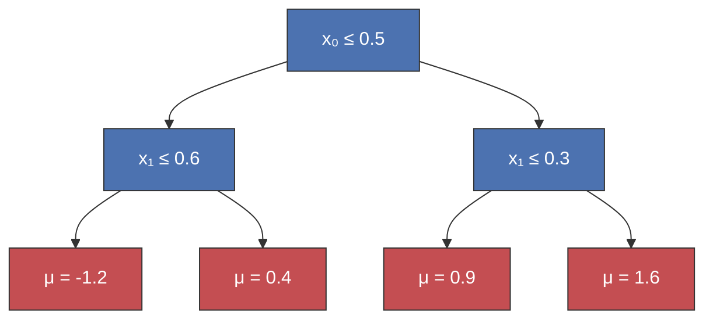
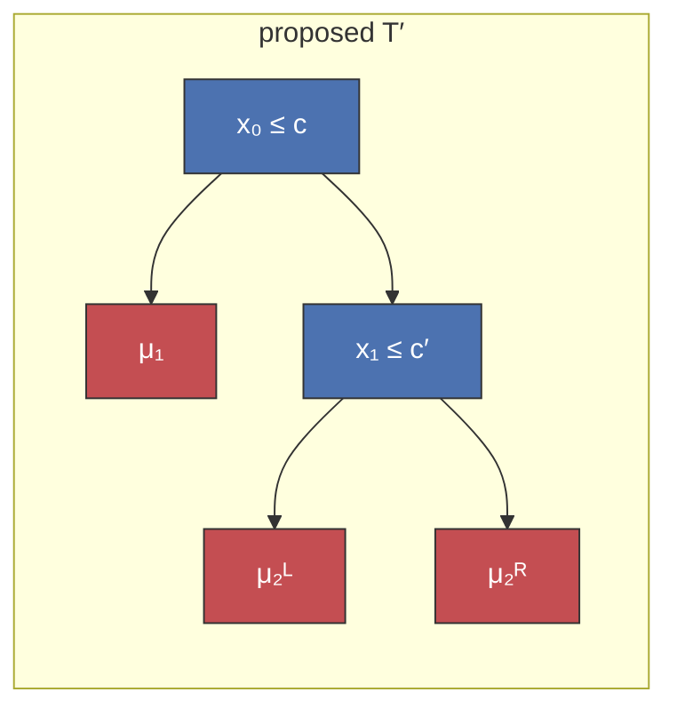

# How BART works

<div class="text-3xl text-sky-700 opacity-90 mt-1 mb-12">Bayesian Additive Regression Trees, from scratch</div>

**Chris Fonnesbeck** · PyData London 2026

<!--
- Session 1 of the BART tutorial: the algorithm itself.
- By the end we will have walked every moving part of the sampler — no library, pure NumPy.
- Notebooks 02–04 then drive pymc-bart on real problems.
-->

---
layout: section
color: navy
---

# Start with a familiar model

<!-- Before adding anything, look at what plain gradient boosting gives us. -->

---

# Gradient boosting


<!--
- sklearn GradientBoostingRegressor, defaults. 80 noisy points, a step at x=0.4 and a hump at x=0.75.
- Fast, accurate point predictor.
- But: one curve, no uncertainty, equally committed where data is dense and where it is sparse.
-->

---

# Same data, with BART


<!--
- Same sum-of-trees structure, plus a full posterior: blue posterior mean + shaded 90% band.
- The band widens where the data thins out — calibrated uncertainty.
- We will build every line of this fit in pure NumPy.
-->

---

# So what is BART?

- Structurally like **gradient boosting** — a prediction is a *sum of many small trees*.
- Behaviourally like a **random forest** — each tree is a *weak learner*; the ensemble is their consensus.
- But **Bayesian**: the sampler returns a *posterior over functions*, so every prediction carries the credible band you just saw.

<!--
- Chipman, George & McCulloch (2010) state the boosting/RF lineage in the original paper.
- The novelty is HOW trees are generated: a Bayesian MH move over tree structure, not a greedy gradient step. (We build that next.)
- One method, many outcomes: regression, classification, survival — swap the likelihood, same sampler. Notebooks 02–04.
-->

---
layout: section
color: navy
---

# Bayesian inference, briefly

<!-- One linear primer; lead with intuition. -->

---
layout: side-title
side: left
color: sky-light
titlewidth: is-5
align: rm-lm
---

::title::

# Bayes' rule

::content::

$$\Large P(\theta \mid D) = \frac{P(D \mid \theta)\,P(\theta)}{P(D)}$$

<br>

| Term | Name |
|------|------|
| $P(\theta)$ | **prior** — belief before data |
| $P(D \mid \theta)$ | **likelihood** — fit to data |
| $P(D)$ | **evidence** — marginal likelihood |
| $P(\theta \mid D)$ | **posterior** — updated belief |

The evidence $P(D)$ only rescales, so **posterior ∝ likelihood × prior** — and that **prior is regularization** (L2 weight decay, a `max_depth` cap, shrinkage).

<!--
- A parameter is a distribution, not a single value; prior, updated by likelihood, yields posterior.
- With more data the likelihood dominates; with less, the prior. In BART, the prior is exactly what keeps each tree a weak learner.
-->

---
layout: center
---

# A Gaussian example

Estimate a sensor's true mean $\mu$ from a prior $\mathcal{N}(\mu_0, \tau^2)$ and $n$ readings:

$$\mu \mid y \sim \mathcal{N}\!\left( \frac{\tau^{-2}\mu_0 + \sigma^{-2} n\,\bar y}{\tau^{-2} + \sigma^{-2} n},\; \bigl(\tau^{-2} + \sigma^{-2} n\bigr)^{-1} \right)$$

<br>

Each source contributes a **precision** ($1/\text{variance}$); the posterior mean is
their precision-weighted average — the algebra of weighted least squares.

<!--
- Every leaf in a BART tree is exactly this Gaussian–Gaussian update.
-->

---
layout: center
---

# The marginal likelihood

$$\Huge P(D) = \int P(D \mid \theta)\,P(\theta)\,d\theta$$

<br>

The denominator we cancel becomes the **score for a model structure** — how well
a *tree shape* explains the data, with leaf values integrated out.

BART uses it to compare candidate trees **without ever sampling their leaves**.

<!--
- Holds the structural part of the sampler together; comes back in the MH ratio.
-->

---
layout: section
color: navy
---

# MCMC, briefly

<!-- The posterior has no closed form in general — so we sample. -->

---
layout: side-title
side: left
color: sky-light
titlewidth: is-5
align: rm-lm
---

::title::

# Metropolis–Hastings

::content::

Propose $\theta'$, accept with probability

$$\alpha = \min\!\left(1,\; \frac{P(\theta' \mid D)}{P(\theta \mid D)} \cdot\; \frac{q(\theta \mid \theta')}{q(\theta' \mid \theta)} \right)$$

<br>

- The **likelihood ratio** is the marginal-likelihood score from the last section
- The right factor corrects for asymmetric proposals ($=1$ when symmetric)

<!--
- When BART proposes a deeper tree, it scores the new structure's marginal likelihood vs the old.
- Higher-scoring structures get accepted more often.
-->

---

# Metropolis–Hastings in seven lines

```python
# random-walk Metropolis on a Beta(3, 2) target
for t in range(n_draws):
    x_new = x + rng.normal(scale=step)
    lp_new = log_target(x_new)
    if np.log(rng.uniform()) < lp_new - lp:   # accept?
        x, lp = x_new, lp_new
    draws[t] = x
```


<div class="text-center text-sm opacity-70 mt-1">The histogram of draws recovers the Beta(3, 2) target. BART runs this same accept/reject loop over <b>tree structures</b> instead of a scalar <code>x</code>.</div>

<!--
- One accept/reject per iteration; the chain's histogram recovers the target.
- This is the engine; BART runs it over tree structures instead of a scalar x.
-->

---
layout: section
color: navy
---

# A single regression tree

<!-- A tree is a piecewise-constant function: route a row to a leaf, return its mu. -->

---
layout: two-cols-title
color: white
---

::title::

# A tree partitions the input space

::left::


::right::



<!--
- Each region is one leaf, painted with its mu.
- Internal node: a rule x_v <= c. Leaf: a scalar mu.
-->

---
layout: center
---

# Stored as six parallel arrays

A leaf is any node with `split_var == -1`.

```python
class Tree:
    split_var   # -1 if leaf, else the column to split on
    split_val   # cut threshold
    left, right # child indices (-1 for leaves)
    parent      # parent index (-1 for root)
    mu          # leaf value
```

Tedious to read, but **cheap to copy** — the sampler copies a tree on every move.

<!-- The representation is deliberately flat so copy() is fast. -->

---
layout: section
color: navy
---

# Sum of trees

---

# BART is additive

$$\Large f(x) = \sum_{j=1}^{m} g(x;\, T_j, M_j)$$


<!--
- Many SHALLOW trees, each fit to the residual after subtracting the others.
- m=1 is one coarse step; by m=100–200 the staircase is fine enough to track the hump.
-->

---
layout: section
color: navy
---

# Prior on tree shape

<!-- What stops one tree from absorbing the whole signal? The prior. -->

---

# Depth is penalised exponentially

Each split decision at depth $d$ is Bernoulli with $\;P(\text{split}) = \alpha\,(1+d)^{-\beta}$ &nbsp;(Chipman et al. 1998)


<!--
- Higher alpha: grows more eagerly at the root. Higher beta: punishes depth harder.
- Default (alpha, beta) = (0.95, 2.0) concentrates mass on 2–4 leaf trees.
- MH will still accept deeper trees when the data demand it — the prior just keeps pulling back.
-->

---

# Trees drawn from the prior


<!-- Most draws are stumps; deep trees are rare but possible. Blue = internal, red = leaf. -->

---
layout: section
color: navy
---

# Conjugate leaf updates

<!-- Structure and labelling are separated. Given structure, the leaves are easy. -->

---

# Leaf values: a shrinkage estimator

$$\mu_\ell \mid r \sim \mathcal{N}\!\left( \frac{n_\ell \sigma_\mu^2}{\sigma^2 + n_\ell \sigma_\mu^2}\,\bar r_\ell,\; \frac{\sigma^2 \sigma_\mu^2}{\sigma^2 + n_\ell \sigma_\mu^2} \right)$$


<!--
- Normal prior on the leaf + Normal residuals = conjugate Normal posterior.
- Posterior mean pulls each leaf's sample mean toward zero — hard for small leaves, gently for big ones.
- The closed form also lets the MH move integrate mu out when scoring structures.
-->

---
layout: center
---

# One leaf draw

```python
def draw_leaf_values(tree, X, r, rng, sigma2, sigma_mu2):
    for lf in tree.leaves():
        n_l = (leaf_of == lf).sum()
        s_l = r[leaf_of == lf].sum()
        post_var  = sigma2 * sigma_mu2 / (sigma2 + n_l * sigma_mu2)
        post_mean = post_var * s_l / sigma2
        tree.mu[lf] = rng.normal(post_mean, np.sqrt(post_var))
```

Called once per tree per sweep, after the structure move is accepted.

<!-- Direct read of the conjugate formula on the previous slide. -->

---
layout: section
color: navy
---

# Metropolis–Hastings on tree structure

<!-- Trees live in a discrete space — no gradients. Two structural moves. -->

---
layout: two-cols-title
color: sky-light
---

::title::

# Grow and prune

::left::

**Grow** &nbsp;Pick a leaf; split it on a random variable and cut from the data inside it.

**Prune** &nbsp;Pick a *singly-internal* node; collapse it back to a leaf.

<br>

Leaf values integrate out via the marginal likelihood:

$$\small p(r \mid T, \sigma^2) = \prod_{\ell} \sqrt{\tfrac{\sigma^2}{\sigma^2 + n_\ell \sigma_\mu^2}}\, \exp\!\left(\tfrac{\sigma_\mu^2 s_\ell^2}{2\sigma^2(\sigma^2 + n_\ell \sigma_\mu^2)}\right)$$

::right::



<div class="text-center text-sm opacity-70">grow turns leaf μ₂ into a split</div>

<!-- Never track mu during the structural move — that is the trick. -->

---
layout: center
---

# The acceptance ratio

$$\log A = \underbrace{\log\frac{p(r \mid T')}{p(r \mid T)}}_{\text{likelihood}} + \underbrace{\log\frac{\pi(T')}{\pi(T)}}_{\text{prior shape}} + \underbrace{\log\frac{q(T \mid T')}{q(T' \mid T)}}_{\text{move}}$$

<br>

Accept $T'$ with probability $\min(1,\, e^{\log A})$. &nbsp; **Prune is the time-reversal of grow.**

<!--
- Three pieces: how much better the data fits, how the prior feels about the new shape, and proposal bookkeeping.
- grow_proposal / prune_proposal in the notebook compute each term.
-->

---
layout: section
color: navy
---

# The σ update

---
layout: center
---

# Noise variance: inverse-χ²

$$\Large \sigma^2 \mid r \sim \text{Inv-}\chi^2\!\left(\nu + n,\; \nu\lambda + \textstyle\sum_i r_i^2\right)$$

```python
def draw_sigma2(residuals, nu, lam, rng):
    shape = nu + residuals.size
    scale = nu * lam + np.sum(residuals**2)
    return scale / rng.chisquare(shape)
```

The prior scale $\lambda$ is calibrated by OLS — set $P(\sigma < \hat\sigma) = q$ (default $q = 0.9$).

<!--
- Informative about scale, agnostic beyond that.
- BART happily pulls sigma down as the trees explain more variance.
-->

---
layout: section
color: navy
---

# Putting it together

<!-- The full sampler. -->

---
layout: side-title
side: left
color: sky-light
titlewidth: is-5
align: rm-lm
---

::title::

# One sweep = a Gibbs cycle

::content::

1. **Backfit** — partial residual $R_j = y - \sum_{i\ne j} g(x; T_i, M_i)$
2. **Structure** — MH grow / prune on $T_j$ given $R_j$
3. **Leaf** — conjugate draw of $M_j$
4. **Noise** — inverse-$\chi^2$ draw of $\sigma^2$

<br>

Each block has its own update; one sweep touches every parameter once.
That pattern is **Gibbs sampling**.

<!-- This is run_bart. -->

---

# The BART algorithm — the idea


<!--
- Columns are the m trees, rows are the sweeps. Each sweep, every tree is refreshed by a Metropolis–Hastings move against its partial residual r_j = y − Σ_{i≠j} f_i.
- Within a sweep the bookkeeping is ordered: trees already updated use their new structure/leaf, the rest still use last sweep's.
- Average the per-sweep sums-of-trees (after burn-in) → the posterior mean and its band. This is the whole algorithm in one picture.
-->

---

# `run_bart`, the loop

```python
for it in range(n_iter):
    for j in range(m):
        Rj = y - tree_preds.sum(0) + tree_preds[j]        # backfit
        move = "grow" if rng.random() < 0.5 else "prune"
        t_new, logA = propose(move, trees[j], X, Rj, ...)  # MH structure
        if t_new is not None and np.log(rng.random()) < logA:
            trees[j] = t_new
        trees[j] = draw_leaf_values(trees[j], X, Rj, ...)  # leaf
        tree_preds[j] = predict(trees[j], X)
    sigma2 = draw_sigma2(y - tree_preds.sum(0), nu, lam, rng)  # noise
```

Every tree starts empty; the calibrated leaf prior keeps each tree's
contribution small, so no single tree dominates from the first sweep.

<!-- The whole algorithm is this nested loop plus the proposals we built. -->
<!-- Init: trees are empty stumps; the sigma_mu = 0.5/(k*sqrt(m)) prior shrinks each leaf draw, so the first prediction is a small fraction of ybar, not ybar itself (ISLP's f^1 = ybar is a one-tree simplification). -->

---
layout: center
---

# What BART delivers

The sampler returns $B$ sums-of-trees, one per sweep: $f^{(1)}, \dots, f^{(B)}$.

<br>

Drop the first $L$ (**burn-in**) and **average the rest** — that average is the posterior mean:

$$\hat f(x) = \frac{1}{B-L}\sum_{b=L+1}^{B} f^{(b)}(x)$$

<br>

**Percentiles** of the kept draws give the **credible band** — the blue shading in the hero figure.
A point estimate *and* its uncertainty, from one fit.

<!--
- The payoff of the Bayesian sampler: not one curve but a posterior over curves.
- L is the burn-in we discard; the rest are the posterior draws of f.
- Mean for the prediction, spread for the band — BART speaks in credible intervals.
-->

---

# Calibration check on Friedman


<!--
- Friedman DGP: the true f and true sigma are both known.
- 90% intervals cover ~90% of the truth, in-sample AND out-of-sample. Points near the diagonal.
- The sampler is calibrated.
-->

---
layout: section
color: navy
---

# Choosing m

<!-- The one knob whose right value is genuinely problem-dependent. -->

---

# Too few trees inflate σ̂


<!-- With few trees, residual mean structure leaks into the noise term. As m grows the sigma posterior concentrates toward the true noise floor (0.15 here). -->

---

# More iterations don't overfit


<div class="text-center text-sm opacity-70 mt-1">Gradient boosting drives its <b>training</b> error toward zero while its <b>test</b> error turns back up — the widening gap is overfitting. BART's train and test error settle together and stay flat.</div>

<!--
- The classic train/test overfitting picture: boosting's test error turns up as the train error keeps falling — the gap IS overfitting.
- BART's train and test stay close and flat: the posterior average over draws cannot memorise the way a longer boosting run does.
- All four curves are MSE vs the OBSERVED (noisy) targets — the standard learning-curve reference, the only one on which "training error falls to zero" is meaningful.
- Noisier Friedman than the rest of the deck (noise 5 vs 1) + shallow boosting trees: overfitting is invisible on clean data, so this regime is chosen to make the contrast land. The ISLP Heart-data demo, on our own DGP.
-->

---
layout: section
color: navy
---

# Interpreting the fit

<!-- Two diagnostics come free from the posterior. -->

---

# Variable importance: restricted R²

$$\small R^2_k = 1 - \frac{\operatorname{Var}\!\bigl(\hat f^{\text{full}}(x) - \hat f^{\text{restricted}}_k(x)\bigr)}{\operatorname{Var}\!\bigl(\hat f^{\text{full}}(x)\bigr)}$$


<!-- Prune posterior trees to a top-k subset, predict, compare to the full model. Reuses the trees we already drew. Curve flattens at the 5 relevant Friedman variables. -->

---

# Partial dependence & ICE

$$\small \mathrm{PD}_j(v) = \frac{1}{n}\sum_{i=1}^{n} f\!\left(x_i^{(j \to v)}\right) \qquad \mathrm{ICE}_{j,i}(v) = f\!\left(x_i^{(j \to v)}\right)$$


<!--
- PDP: average the counterfactual prediction over all rows — the marginal shape of x_j.
- BART gives a posterior over the PDP for free.
-->

---

# ICE: the per-row curves behind the PDP


<!--
- Parallel curves ⇒ additive feature; crossing curves ⇒ interaction.
- pymc-bart ships pmb.plot_pdp and pmb.plot_ice.
- Notebook 02 uses plot_pdp; notebook 04 uses plot_ice (per-individual hazard).
-->

---
layout: center
---

# A note on Particle Gibbs

MH grow/prune mixes well on small trees but **stalls on large ones**.

**Conditional SMC** grows several whole trees in parallel with resampling,
fixing one particle to the current tree.

<br>

This is the sampler `pymc-bart` uses by default — exposed in notebook 04 as `pmb.PGBART(...)`.

<!-- We don't build PG from scratch; the weight bookkeeping distracts from the core ideas. -->

---
layout: section
color: navy
---

# Sparsity in high-dimensional X

#### Linero's prior

---

# Dirichlet–categorical split selection

When most of $p$ covariates are noise, uniform splitting wastes proposals. Linero (2018):

$$s \sim \operatorname{Dir}\!\left(\tfrac{a}{p}, \dots, \tfrac{a}{p}\right), \qquad v \mid s \sim \operatorname{Cat}(s)$$


<!--
- Small a concentrates on a few variables; large a approaches uniform.
- s is updated adaptively during burn-in, then frozen.
- Reinforcement dynamic: needs room (more trees, longer adaptive phase) to be robust.
-->

---
layout: center
---

# When to reach for it

<div class="text-xl leading-relaxed">

- Suspect **most columns are irrelevant** — genomics, drug discovery, "throw everything at it".

- Give it room: more trees, a longer adaptive phase, sometimes a prior on $a$ itself.

- Production version: the `split_prior` argument of `pmb.BART` (notebook 03).

</div>

<!-- The from-scratch version shows the mechanism, not the tuning that makes it robust. -->

---
layout: section
color: black
class: text-center
slide_info: false
---

# Let's run some code!

<!--
- Hand off to the pymc-bart application notebooks.
- 02: F1 lap times, the Student-T escalation, the m-sweep.
- 03: probit classification + GSS ordered probit, the sparsity prior.
- 04: discrete-time survival, explicit PGBART step.
-->
